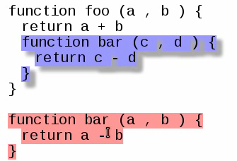

# Cow: Semantic Version Control

Cow is a tool that compares and merges code more intelligently by diffing and analyzing parse trees rather than plain text. I've been working on this project on-and-off[^1] for a few years, with significant help from [Ankur Dave] and Dimitri DeFigueiredo.

The code is available on [GitLab].

[Ankur Dave]: http://ankurdave.com
[GitLab]: https://gitlab.com/tikhon/cow

Here's a [brief screencast](cow-out.ogv) giving a demo of the system's basic capabilities (based on an old proof-of-concept implementation). The proof-of-concept included the ability to find move blocks of code in simple JavaScript programs:

[^1]: More off than on, unfortunately. Cow started out as my final project for CS 164 in 2012 and I've worked on it in spurts since, whenever motivation, schoolwork and actual work permitted.

# Goals

Here are the features I'm aiming for:

  1. **Syntax-awareness**: by working with parse trees, all our results follow the syntax of the code, not how it looks in text. This will allow us to selectively and intelligently ignore unimportant changes like whitespace as well as differentiating between changes to code and to comments or documentation.

  2. **Better grouping**: by considering the parse tree, we'll naturally group related changes together, letting our diff be a more intuitive summary of the changes to a program.

  3. **Move detection**: based on our intelligent grouping, we can detect when whole blocks have been moved or copied---even if they were slightly changed in the process.

  4. **Conflict resolution**: our high-level insight into the kinds of changes applied to the program will make automatic conflict resolution more intelligent, including resolving certain kinds of conflicts that *lexically overlap*.

  5. **Additional analysis**: by exposing everything from the diff to the substructure mapping in a convenient way, we'll be able to write more language-specific analyses like using scope analysis to detect when a variable was renamed.

# Progress

The current code is really rough. The core $$O(n^2)$$ edit distance algorithm works properly, but needs to be adapted to handle larger files (probably by a separate alignment pass before the actual diff). To test it I have a JavaScript parser which has not been tested extensively but does a reasonable job on real-life JavaScript programs I've written in the past.

Before the current iteration, I had a proof-of-concept I developed in CS 164 with Ankur Dave. I didn't really know what I wanted to accomplish so it's rough and hard to follow. I also never managed to get the diff algorithm working efficiently (partly because it was never well-specified), so never tested anything on non-trivial amounts of code. The new diff algorithm fixes this problem, but the rest of the system hasn't been updated to match it.

The main work now is testing the diff algorithm with different heuristics and updating the move detection and merging to work with my new code.

# Architecture

The current approach is structured as a pipeline of several distinct algorithms. Each one will provide an intermediate form with a clear interface, making it easy to plug additional logic between any two steps.

  1. **Parsing**: the only language-specific part of the pipeline is producing the parse trees. In this context, a **parse tree** is a slightly lower-level representation than an abstract syntax tree---it's a tree that's only labeled at its leaves, with exactly one leaf node per token. Reading out the leaves in order complete recreates the input stream of tokens.

    Each language we support will need a custom parser. This is inevitable because the parsing behavior we need for diffing and merging is different from what a compiler requires:

    * We can make distinctions the compiler wouldn't like detecting statements grouped with blank lines.
    * We want to preserve as much lexical information as possible to recreate the program text—especially for merging.
    * Controlling how the code is parsed gives us fine control over the resulting diff, letting us selectively ignore things we don't care about. Think of this as a sophisticated, syntax-aware alternative to ignoring whitespace with normal diff.

  2. **Parse tree diff**: we find a minimal number of additions and deletions to go between two parse trees. The tree structure is used to consolidate multiple changes into one: if you changed most of the lines in a block of code, it's useful to think of that as a single action rather than a bunch of separate actions per line. The threshold for when to consolidate changes is based on a heuristic which will probably have to be tuned per-language.

    This diff is useful on its own to reflect the structure of your code and reduce some of the noise you can get with text-based diff algorithms. However, the main advantage here is for giving the diff some extra structure which can be taken advantage of in analysis passes after the tree diff.

    The current algorithm for calculating the needed changes is a slight modification of the [Wagner-Fischer] algorithm for normal string edit distance. It's based on dynamic programming and runs in $$O(n^2)$$ time and space where n is the total number of nodes in the tree (including internal nodes).

  3. **Substructure detection**: the next step identifies which blocks of code (ie subtrees) correspond between the two trees being compared, with some heuristic for determining when two subtrees are "close enough". This information is used to find blocks of code that were moved and can also be used for additional analysis by a plugin.

    It's useful to think of this as a graph problem where each subtree is a node with edges to each other subtree weighted based on some distance between them (perhaps based on the distances calculated in step 2). Given this graph, there are two possible approaches I'm considering:

    * **bipartite graph matching**: the earlier proof of concept found matching substructures by finding the best match between subtrees from the input and output and keeping all the resulting pairs that were close enough in weight. This approach is solid in common cases where you just move a block of code, but doesn't detect more complex transformations like copying a subtree into *two* places in the new tree.
    * **clustering**: the main alternative I'm considering now is some sort of clustering algorithm that tries to find all the subtrees that are "close enough". This will be able to detect more complex relationships in the code but will likely also depend more on the weights and heuristics used to identify clusters.

  4. **Merging**: the final (optional) step is merging and conflict resolution. One of the neat advantages to how the tree diff was designed for step 2 is that the resulting diff is a parse tree itself with some additional annotations. This allows us to find conflicts by doing a diff-of-diffs.

    Once we have a diff-of-diffs, we should be able to resolve more conflicts than a purely text-based system thanks to the high-level information we derived in the previous steps. For example, we can apply *both* a move *and* a modification to a block even if the changes physically overlap in the text.

    Merging is the least-developed step currently. The approach I described worked well in the old proof-of-concept but I've since rethought many of the details leading up to. I'll put more thought and work towards merging once I get the previous steps working smoothly.

[Wagner-Fischer]: https://en.wikipedia.org/wiki/Wagner%E2%80%93Fischer_algorithm

