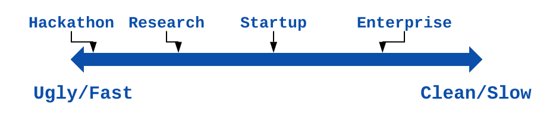

Recently, I saw a fascinating question [on Hacker News][hn-thread]: "How bad should the code be in a startup?"[^blog-post]

This is an important question! It doesn't just apply to startups; I've seen the same question—implicitly or explicitly—about everything from proof-of-concept projects, research code, data science work and hackathons. So how do we figure this out?

A common mental model I've seen puts this question on a spectrum: there is a linear trade-off between code quality and speed.

With this model, you figure out how much initial speed matters compared to long-term maintenance cost and write uglier or cleaner code based on that. 24-hour hackathon? Super ugly code. Early-stage startup? Pretty ugly code. Long-term enterprise software project? Clean code.

I used to think this way myself. Now, with more experience, I'm convinced this mental model is simply *wrong*. There is no trade-off. Write reasonably clean code from the beginning and you'll save yourself time in a matter of days if not hours.

[^blog-post]: This whole post is an extension of [a comment][hn-comment] I left on that HN thread.

[hn-thread]: https://news.ycombinator.com/item?id=23446627
[hn-comment]: https://news.ycombinator.com/item?id=23448480

<!--more-->

So what changed my view on code quality? Why do I think that clean code is *faster* to write, even in the short term?

It comes down to three core factors:

  * Clean code is not substantially slower to write. 
  
    You just have to have the right habits from the get-go. People avoid writing quality code because they don't have and don't want to build these habits, not because it's inherently harder.

  * You'll spend less time debugging. 
  
    Mentally, it's easy to separate how long it takes to write the "initial" version of the code, and how long it takes to iron out all the "obvious" bugs. If you account for both, any extra time in writing clean code will be canceled out by spending less time hunting down "obvious" errors.

  * Adding features and making changes is *far* easier.

    A clean codebase lets you be *more* agile rather than less—it actually *helps* you iterate quickly.

The most extreme environment to see this in action is a hackathon. You only have 24 or 48 hours to build something and the code is 100% throw-away—nobody's touching it after the judging is done. I participated in a few hackathons [as a student][CSUA-hackathon] and wrote some messy code. Looking back, I am certain I would have accomplished *more* in the same time-frame had I written cleaner code instead.

These days I don't feel like pulling all-nighters for hackathons—[sleep probably matters *more* than clean code][sleep-article]—but I've done a few 72-hour Ludum Game Jams. I've seen clean, well-factored code pay off massively over this time scale. Collectively, we only spent 54 hours working on [Asteroid Tycoon][asteroid-tycoon] and, even within that time frame, an extensible design in the code let us build a surprisingly broad game. We could add new features and cute little touches even as the deadline was fast approaching; the game would not have been as varied or charming had the code been substantially worse[^1].

[^1]: Would we have benefitted had the code been *better*? Counterfactuals are always hard, but I think we would have. I'm certainly a much better programmer now than I was in 2014, with much more thorough habits around code hygiene. I bet that 2020 me would have spent less time debugging and more time tweaking, play-testing and iterating than 2014 me, which might have helped make the gameplay less repetitive and more rewarding.

[CSUA-hackathon]: https://www.huffpost.com/entry/for-the-win-at-the-berkel_b_844749?guccounter=1&guce_referrer=aHR0cHM6Ly93d3cuZ29vZ2xlLmNvbS8&guce_referrer_sig=AQAAAAPYarjlEP4yJNSBzSg3VwZaUTjFVXN4us5iQnITu778naJ-LPQ97eYQR_b5jJTgHvs18uFSLuOZ-DmBPJ5_YjrBAXV4CEMr2y9-X8a-rxMK78GieQOXyHQ5IPdKsC1RHTzN0qJEJBUttxDYEyepoNP2K2vVpCtW5LmKIviasoQ3

[asteroid-tycoon]: http://ludumdare.com/compo/ludum-dare-29/?action=preview&uid=3353

[sleep-article]: https://increment.com/teams/the-epistemology-of-software-quality/

There's a lesson here: good code makes your own job easier. And you know what happens when your work gets easier? You do it faster, sure, but you also do it *better*. 

I know that many researchers think "my code is just a research prototype I'll throw away after writing a paper; why should I care about code quality?" I believe this view makes your *research* worse. Not just your research *code*[^2], but the research itself. I'm not even talking about [bugs compromising research results][research-bugs]! It's more than that: messy code will make your research less ambitious.

Here's a hypothetical scenario based on research work I've observed: you have a messy prototype, you've hacked together a few benchmarks (publications *love* benchmarks), you're 80% done with your paper and the deadline is in 24 hours. You haven't procrastinated a much as you could have, but there's still a lot left to do. You're finishing up your related work section and you suddenly come up with a small new feature or a new benchmark to run—not make-or-break for your results, but a definite improvement.

What are the chances this idea can make it into your paper before the deadline?

Depends on the state of your code!

I've seen projects where a slightly different benchmark with the core system would take *hours* to set up and debug. You're tired and stressed out; it'll probably take even longer. There's no way you'll fit that work in before the deadline.

I've seen other projects where the code was clean from the get-go. A new benchmark with new inputs would take 30 minutes to prepare and would work with little-to-no debugging. You had your new idea, you tried it, maybe it makes it into the final paper, maybe it doesn't, whatever. Either way, your research project was that extra bit more thorough.

Help yourself do better research. Write cleaner code.

[research-bugs]: https://www.ncbi.nlm.nih.gov/pmc/articles/PMC4629271/

[^2]: Of course, the code itself matters too! How can your research be reproducible if people can't inspect and reproduce the code you used for your analysis?

I had a similar change in views with version control. When I started out programming, I thought that version control was great... for big projects with multiple people. These days, I keep *everything* I work on in Git. What changed? Two things: I learned Git well enough so that it did not take much extra work and effort, and I had a few experiences on projects where either version control saved my bacon or, more painfully, *would* have saved my bacon had I been using it. Even a single incident where I didn't have to redo a couple days' worth of work more than pays for the overhead of using Git. And that's ignoring other benefits like being able to work on multiple experimental branches simultaneously, debug issues with `git bisect` and easily bring on new contributors part of the way through a project.

Version control makes sense from the very beginning whether you're at a 24-hr hackathon, you're working towards a paper deadline in a week or you're searching for product-market fit at a startup. The dynamic for clean code is exactly the same.

All this theorizing is great, but just what *is* clean code? Let's be honest: throughout the whole article, I've been using "clean code" without a real definition. Weasel wording.

Annoyingly, I can't give you a 100% complete definition myself.

Crucially, it's not a matter of blindly applying "best practices". A lot of "best practices" *are* overkill for smaller projects, and over-engineering from the beginning can be fatal for a project.

So is my advice just "it's better to write *good* code than to write *bad* code"? I mean, yes, that is the advice. If you can do that you're golden. The only real way to learn this is through experience[^3].

But at least I can give you some hints and guidelines to get you started.

The easiest place to start is to focus on **code hygiene**. By "hygiene", I mean factors that keep your code easier to read and work with and might change *how* you write the code, but don't require much *extra* coding or work:

  * Always use clear, intuitive names for variables and functions. At most, this costs a bit of extra thinking each time you introduce a new idea, and it never hurts. Just do it.

    Bonus rule of thumb: spell things out completely. If you avoid shortening words, you won't have to remember whether you spelled "expression" as "exp" or as "expr"—it's always "expression".

  * Write small functions and classes that each do one clearly-defined conceptual "thing". You should be able to summarize what a class or function represents in a single short sentence. If you can't, break it up.

  * Avoid "hidden" dependencies in your code. Pass things in as arguments—don't silently mutate values in the global scope. Just as classes and functions should have a single clear purpose, they should be able to stand alone. This makes your code easier to understand *and* easier to test.

  * Before implementing a function, write out its docstring/API documentation. This helps you understand what you're about to implement, ensures the function has a single well-defined purpose *and* means the code is documented by default. Once you get in the habit of doing this, it takes almost no extra time.

  * Group your code based on its own logic, not based on implementation details. Having a bunch of definitions or "utility" functions in a single file makes it much harder to navigate the codebase than keeping related functionality together.

  * Keep your business logic, I/O and framework code as separate as possible. You want to be able to think about the *logic* of your code separately from how it interacts with the outside world. This is another thing that also makes your code way easier to test.

On top of this, there are a few practices that go a bit beyond "hygiene"—they definitely take extra work—but easily pay for themselves. I've found two in particular that pay off on almost any timescale:

  * **Automated tests**. Yeah, writing tests is a drag. But look: if you want to use your code, you'll be testing it one way or another. Testing manually might be faster the first time you do it, but you'll have to repeat that manual process each time you find a bug or make a change to the code. Refactoring? Forget about it.

    And hey, writing unit tests—once you have a test suite set up—doesn't take that much more effort than testing the code manually! All you have to do is come up with inputs, understand what outputs you expect and put that into your test suite. Then, whenever you make a change, re-running the same tests is a button-click away.

    As a bonus unit tests in particular keep you honest about your code design. Writing code with testing in mind makes good architectural choices the path of least resistance.

  * **Reproducible builds and deployments**. You want people to be able 
to work on or just run your code without spending a lot of manual effort setting up an environment and pulling in dependencies. Doing this requires knowing your language's packaging system and probably a general-purpose tool like [Nix] or [Docker] and a bit of up-front setup, but it's absolutely worth it.

   I've worked at startups where on-boarding a new person would take two or three person-days of focused work, and bugs would constantly crop up because of different environments in dev and production or even between different developers. The process for deploying code or setting up a development environment existed only in Readmes or in people's minds. What happens if your development machine crashes? How long until you're productive again? If your system is automated and reproducible, these things are simply not a problem.

Should you do *all* of these things? Is this *all* you should do?

I doubt it. I just hope it gives you a solid starting point.

[Nix]:https://nixos.org/
[Docker]: https://www.docker.com/

[^3]: Experience is *necessary* but not *sufficient* to learn how to write clean code reliably. I've worked with plenty of experienced people who *don't* have the right habits and make a mess for themselves and others. But I still think that experience, coupled with mentorship, is the only way to *really* learn this.
