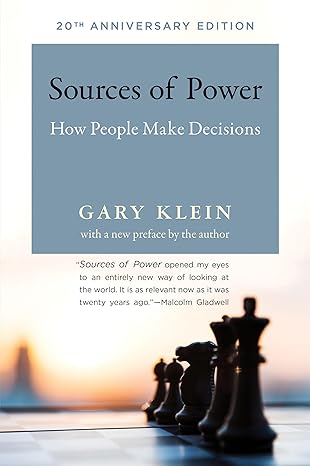

In my career, I've had the fortune to work with and observe a number of real experts in their fields. Expert programmers, statisticians, designers and leaders. Each person and each field were different, but there were broad similarities in how all the experts made decisions. The most effective teams I worked on not only *included* experts but also made room for them to work *as experts*.

But what does this actually entail?

Experts are not “beginners with more knowledge”; their expertise allows them to operate in a categorically different—and more effective!—manner. To work with experts effectively, we need a model of how they actually work.

What makes an expert an expert?

How do experts make decisions?

<!--more-->

Gary Klein's [*Sources of Power*][sources-of-power] is my go-to book for understanding how experts make decisions in difficult, high-context situations. Most research around decision focuses on novices making intentionally artificial decisions in laboratory connections. By contrast, Klein's work is interesting because he used qualitative methods to study **naturalistic decision making** in complex real-world scenarios.

*Sources of Power* covers a number of different strategies that experts use in nonroutine situations, based on field studies across firefighters, nurses, military commanders, engineers and other specialists. Across all the fields studied, experts rarely used formal decision-making techniques based on listing or comparing possible alternatives; instead, experts made decisions following a model Klein calls **[recognition-primed decision making][rpd]** (RPD), which gives us a foundation for understanding how experts really work.[^work-as-done]

[^work-as-done]: Borrowing an idea from safety and resilience research, Klein's fieldwork helps us understand **work-as-done** rather than **work-as-imagined** or **work-as-prescribed**.

::: {.pull-quote .right}
> Experts are not “beginners with more knowledge”; their expertise allows them to operate in a categorically different—and more effective!—manner.
:::

The core idea in RPD is that **experts make decisions by finding parallels—consciously or subconsciously—between the current situation and their past experience**. For most decisions, an expert will not carefully list out and consider how to optimize a situation based on “pros and cons”; instead, they will draw analogies to prototype situations from their experience, mentally simulate solutions in the immediate context and **satisfice** rather than optimize (that is, they will find a solution that is *good enough* rather than searching for the *best possible* approach).

Both intuition *and* analysis are key to the model, as explained in the 20th Anniversary Edition forward to *Sources of Power*:

> Inevitably, the success of *Sources of Power* also encouraged caricatures and oversimplifications. One of the most common, and most annoying, is that the RPD model is just about using intuition and gut instinct, as opposed to more systematic decision strategies. Actually, the RPD model posits a two-stage process, starting with intuition, as decision makers recognize how they need to respond, followed by deliberate evaluation as they simulate a possible response to see to see if it will work. A blend of intuition and analysis, not just gut feelings.

One criticism I've seen is that the RPD model is “obvious”. And it *is* obvious, at least in hindsight. If you've seen experts in action or you've developed expertise in some field yourself, the RPD model immediately clicks. Klein found this in his own work:

> As we began to present our findings at conferences, we got the reactions, “Of course that's how people make decisions.” Our findings seemed obviously right to everyone, even though they were so different from earlier decision theories. We began to realize that the force of our findings was in their obviousness. Of course the RPD strategy was the strategy used most frequently.

The obviousness is misleading. The RPD view of expertise has non-obvious consequences that I've seen both in qualitative research (like the case studies described in *Sources of Power*) as well as my own experience; more importantly, I've seen too many managers and informal leaders act in ways inconsistent with this “obvious” understanding of expertise, inadvertently building environments hostile to expert decision making.

Perhaps the “obvious” idea is not *always* obvious!

## Understanding Experts

It's tempting to simplify the RPD model into a truism: experts make decisions based on experience. While this is a true observation, it misses the structured strategies experts employ using their experience, and it does not capture the nonlinear way experts differ from beginners. To figure out how organizational structure and culture impact expertise, we need more nuance.

::: {.pull-quote .left }
> Experts have sophisticated, intuitive ways to use their experience to make better decisions.
:::

One critical aspect organizationally is that expert decisions are not *legible*.[^seeing-like-a-state]

[^seeing-like-a-state]: I'm borrowing the concept of *legibility* from James C. Scott's *Seeing like a State*.

    Expert decision-making is not legible because experts do not follow clear processes or explain how they work in a way that can be directly understood or controlled by non-experts. Expert decision-making also does not conform to the *aesthetics* of regularized, structured decisions—recognition-primed decisions look less disciplined than explicitly structured approaches.
    
    *Seeing like a State* is a long read, but I would highly recommend it—I unironically describe it as the “single best management book”, even though it is not really about management. A [free online copy][anarchist-library] is available on the Anarchist library. For a shorter introduction to pique your interest, [“A Big Little Idea Called Legibility”][ribbonfarm-legibility] on Ribbonfarm seems like a good starting point.
    
    The final section of the book [“A Case for Mētis-Friendly Institutions”][metis-friendly] covers the same general thesis as this article.
    
[ribbonfarm-legibility]: https://www.ribbonfarm.com/2010/07/26/a-big-little-idea-called-legibility/

[anarchist-library]: https://theanarchistlibrary.org/library/james-c-scott-seeing-like-a-state

[metis-friendly]: https://theanarchistlibrary.org/library/james-c-scott-seeing-like-a-state#toc113

The “classical” model for decision making is that “good” decisions come from an explicit process like comparing alternative possibilities detail-by-detail. I remember being taught to list out “pros” and “cons” to make decisions in high school, and I've seen similar frameworks recommended in business books and pushed by managers.

If an expert would just write out the possibilities and list out pros and cons, anybody could follow the same reasoning and come to the same decision. Right?

That is simply not how experts make decisions. Here's what Klein found by interviewing firefighting commanders about difficult fires they fought:

> We asked people to tell us about their hardest cases, thinking that these would show the most decision making. But where were the decisions? The commander sees a vertical fire and knows just what to do. But in an instant, that decision is negated because the first has spread. He still knows just what to do in this changed situation. He never seems to decide anything. He is not comparing a favorite option to another option... He is not comparing anything.

The way experts make decisions will not naturally be clear to non-expert observers, and may not even be clear to the experts themselves!

So how *do* experts make decisions?

> Our results turned out to be fairly clear. It was not that the commanders were *refusing* to compare options; rather, they did not *have* to compare options. ...The commanders' secret was that their experience let them see a situation, even a nonroutine one, as an example of a prototype, so they knew the typical course of action right away. Their experience let them identify a reasonable reaction as the first one they considered, so they did not bother thinking of others. They were not being perverse. They were being skillful. We now call this strategy *recognition-primed decision making*.

While not every expert decision is amenable to the RPD model, Klein's research found that experts made recognition-based decisions in 80% of the *nonroutine* cases that they investigated—and the percentage would, presumably, be higher for routine problems.

Fighting a fire is a dangerous, high-tempo situation. It is tempting to say that RPD describes how experts make decisions under extreme time pressure, but surely people are more deliberative and explicit when they have more time and space to make decisions?

It turns out that this is not the case.

> The next possibility we considered was that the RPD model held only during time-pressured decisions. To test this hypothesis [we] studied the way design engineers made decisions about interfaces. ... The decisions could stretch out over days, or even months, rather than seconds and minutes. Even here, the majority of tough decisions were coded as RPD strategies.

Even on tasks with long time-horizons, experts like engineers, programmers and architects still make the majority of their decisions with RPD-style strategies. RPD is a strategy that lets people draw on their experiences and expertise to spend less time and mental energy but still reach better decisions than they would with a more deliberative, comparative approach.

Experts across a wide range of fields and time horizons make decisions based on experience rather than using formal comparison-based decision-making processes. Even when experts do reach for comparisons between alternatives, they still mix comparisons with intuition, experience and mental simulation. Rather than being an expert technique, formal comparison-based decision making is used by *beginners* who do not have the experience, confidence and context to come to a confident decision otherwise.

RPD gives us a strong foundation for understanding experts, but it is still a simplified model. The way experts make decisions in the field is nuanced and context-specific. *Sources of Power* goes into substantially more detail, exploring not only how experts use *intuition* but also how they:

 1. Use mental simulation
 2. Spot leverage points
 3. Find nonlinear approaches to ill-defined problems
 4. See[^seeing] the world differently from non-experts
 5. Rely on stories, metaphors and analogies
 6. Share information with other experts on the team
 7. Coordinate and communicate *intent*

(These are the titular “sources of power” experts draw on to make decisions and adapt to complex shifting circumstances.)

[^seeing]: Even the concept of “seeing” is nuanced. I ran into a great observation in Kuhn's *Structure of Scientific Revolutions* about how scientists talk about “seeing” things like particles, when they can really only detect them after statistically processing measurements from sophisticated instruments.

    > We do not see electrons, but rather their tracks or else bubbles of vapor in a cloud chamber. We do not see electric currents at all, but rather the needle of an ammeter or galvanometer. Yet... I have repeatedly acted as though we did perceive theoretical entities like currents, electrons, and fields, as though we learned to do so from examination of exemplars, and as though in these cases too it would be wrong to replace talk of seeing with talk of criteria and interpretation.

    Experts I've worked with consistently talked about “seeing” in the same metaphorical sense: “seeing” the “shape” of a mathematical problem or the “seeing” the structure of a codebase. These are all real aspects of the work that experts *perceive* based on their experience and the skills they've built up over time, but they not aspects that can literally be seen with your eyes.

    There is a big gap between seeing a physical object and the kind of “seeing” that experts think about in complex situations!

    In my earlier post [“By Looking”][by-looking] I wrote a quick observation on how organizations often *aren't* willing to trust expert perception. I should have added a similar note about “seeing” as a metaphor there: sometimes the answer to “how will we know?” absolutely should be “by looking!”... as long as we treat “looking” to mean *expert perception in general*.

[by-looking]: /blog/By-Looking

Expert decision making is complicated. *Sources of Power* is an entire book, and still only summarizes a single research program into decision making.

Experts have sophisticated, intuitive ways to use their experience to make better decisions. The way experts reach conclusions will rarely be *legible* to outside observers (including managers!) and may not even be clear to the experts themselves.

Explaining a decision is a different skill from making a decision!

## (Mis)Managing Experts

Given the recognition-primed decision making model, and given that expert decisions tend to be intuitive and illegible, how do we build teams, cultures and organizations that support experts?

My experience has been that we, largely, don't.

::: {.pull-quote .left style="width: 35%"}
> Expert programmers see programming *as* planning.
:::

I've had the fortune of working on some remarkably effective teams, but these were the exception not the norm—I have seen far more processes and expectations that hinder experts than ones that empower. Managers have *a priori* models for how decisions “should” be made that do not match how experts actually operate. Team culture and processes reflect this disconnect.

For example, I've repeatedly seen managers ask people to break tasks down into small, explicit subtasks—which is fundamentally at odds with how experts understand their work:

> [Experts] have mental models of how tasks are supposed to be performed, teams are supposed to coordinate, equipment is supposed to function. ...they know how the subtasks fit together and can adapt the way they perform individual subtasks to blend in with the others. This makes their performance so smooth. They do not even feel that they are performing subtasks because the integration is so strong. If they have to explain what they are doing to novices, they may have to stop and artificially break it down into subtasks. Often they feel uncomfortable teaching the separate steps because they know they are teaching some bad habits. They are teaching the novices to do the task in a choppy way.

Managers also try to structure work into a uniform planning process, with a clear separation between “planning” and “execution”. Klein's research into planning across a number of military and rescue teams found that “planning is not a simple unified activity”; the approach, complexity and detail of plans varied based on context, and plans were often abandoned when circumstances changed. Some problems have circumstances that require separate planning and execution, but in areas that don't, experts naturally combine planning, iteration and execution into a single activity. I've seen this consistently myself in the software field. Expert programmers see programming *as* planning.[^programming-as-design]

[^programming-as-design]: Programming languages are, perhaps counterintuitively, amazing tools for planning and design—perhaps more than they are tools for telling computers what to do. Programming-as-planning is what lets programmers manage an amazing amount of complexity, and the amount of complexity programmers are expected to manage *necessitates* seeing programming as planning.

    [Laurence Tratt][laurence-tratt], a professor of software engineering at KCL, describes this as the “circular specification problem” in [“What Factors Explain the Nature of Software?"][factors]:

    > Our ability to specify what a given piece of software should be is limited by the circular specification problem. We nearly always have to fully build the software in order to know precisely what we want it to be.

    This is both a blessing and a curse of programming as a field, and for the role programming languages as tools play in this dynamic. But that is a topic for another article.

[laurence-tratt]: https://tratt.net/laurie/

[factors]: https://tratt.net/laurie/blog/2024/what_factors_explain_the_nature_of_software.html

And, as we've seen earlier, formal decision making models based on comparing alternative options do not reflect the actual recognition-driven process experts use for most of the decision points in their work.

::: {.pull-quote .right style="width: 45%"}
> They do not even feel that they are performing subtasks because the integration is so strong.
:::

These three management behaviors follow the same pattern: managers expect expert decision making to be legible to non-experts, and the processes they develop reflect how *beginners* approach unfamiliar situations. My theory is that managers naturally tend towards these models not only because they want more direct control over the work but also because they are extrapolating their expectations from how beginners learn. But experts are not just beginners with more knowledge! Experts have the confidence and experience to operate in fundamentally different, *more effective* ways than beginners. Illegible expert decision making is an evidence of skill, not a lack of discipline.

If you enforce a process based on a beginner-oriented model of the work, you can have one of two outcomes:

  1. You force experts into a beginner decision-making regime. Acting like beginners rather than experts takes more time and energy and results in worse decisions. Experts start to second-guess their own experience or have their decisions countermanded by non-expert observers.
  2. You push experts to hide how they *actually* make decisions. They make decisions in natural, effective ways, but then have to force those decisions into an incompatible framework. This wastes effort, drains morale and gives observers a fundamentally misleading picture of how decisions were made.

In both cases, you're contributing to a culture that is actively antithetical to the effective exercise of expertise.

## Letting Experts *Be Experts*

So what can we do to help rather than hinder experts?

We can certainly do *something*. I've seen first hand how organizations—and even divisions *of the same organization*—differ massively in how well they support expert decision-making. Organizational structure and culture affects how experts do their work; how hard it is for non-experts to develop expertise; and, perhaps most importantly, how much *leverage* experts can exercise.

### Intent-Oriented Leadership

Experts make decisions about what to do and how to do it based on factors that they can't always explain—even to themselves. Trying to force experts to make their work legible, or trying to make decisions *for* experts, keeps them from operating *as experts*. But if you don't track and direct expert work directly, how do you *lead* experts? How can you lead experts in areas where you have not developed expertise yourself?

I've worked with a handful of leaders in the corporate world who managed to do this. How did they do this? It's hard to say precisely because they were experts *at leadership*—so I recognized the same overall trends in how they led as I've seen in other expert work. Their decisions and leadership techniques were not always clear to me as an observer, and sometimes not even clear *to the leader themselves*. Leading experts requires expertise itself! Leadership hinges on tacit knowledge in the same way as performing surgery or landing on an aircraft carrier.

Despite this, I did notice some general trends that can help us lead more effectively.

One accessible pattern is to **lead by intent**. For example, Klein talks about “Commander's Intent statements” in the U.S. Army:

> A technique the U.S. Army has tried is to issue Commander's Intent statements along with its mission orders, or operations orders, which give the detail of the plan for the next day. The Commander's Intent statement helps th soldiers read the commander's mind if they run into uncertainty about how to carry out the orders under field conditions.

Unfortunately the impact of these statements has been limited in practice. It is difficult to convince higher echelon commanders to give up control, and, even when they are willing to do that, communicating intent is just difficult on its own.

From his research on Commander's Intent statements, Klein extracted a set of seven categories of information that are useful for communicating intent:

> 1. The purpose of the task (the higher-level goals).
> 2. The objective of the task (an image of the desired outcome).
> 3. The sequence of steps in the plan.
> 4. The rationale for the plan.
> 5. The key decisions that may have to be made.
> 6. Antigoals (unwanted outcomes).
> 7. Constraints and other considerations.

In my own work, I've found it useful to develop similar frameworks for what information to track and communicate, adjusted based on the context and nature of my work as well as the experience and personalities of the people I am working with.

I've found David Marquet's work on intent-based leadership both practical and inspiring; his book [*Turn the Ship Around!*][turn-the-ship-around] provides an accessible introduction to intent-based leadership illustrated with stories from his time as the captain of the nuclear-powered submarine *USS Santa Fe*.[^video]

[turn-the-ship-around]: https://www.goodreads.com/book/show/16158601-turn-the-ship-around

[^video]: [This video on his work][intent-based-leadership-video] provides a *very* high-level introduction to his ideas.

### Don't Do That

Ultimately, I simply do not have a crisp answer on how to build organizations that enable expertise.

I am far from an expert leader *myself*, but I've had the good fortune to work with some expert leaders directly—and even they did not have a clear idea on exactly how they managed to foster such effective environments and teams. *It's just hard*.

My current philosophy is also the title of this post: how can we **let experts be experts**?

There is no single process that will empower expertise, just like there is no single process that will shut it down completely. But we can inventory the concrete processes and management decisions in an organization and try to understand how they impact expert work. Do the processes provide the space and context experts need to work effectively? Do they push experts into less effective working regimes? If they do, how can we stop that?

One step for supporting experts—easier said than done—is to simply stop doing things that hinder them. Figure out what concrete aspects of our work and processes hinder experts, than change them.

But this is nowhere near a full solution on its own. In the past, I've made the mistake of conflating *the amount* of process with how much space it leaves for experts. But, in hindsight, this perspective missed three core aspects:

 - process is not fungible: some process choices will create obstacles for expertise, but other choices will support it
 - the causality is reversed: it's not that having low process makes space for expertise, but rather making space for expertise *lets* us function with less process[^causality]
 - process is, at most, one of several contributing factors: you can have the absolutely best process but still fail to empower experts for other, often unclear, reasons

[^causality]: Or, better yet, it's a feedback loop: culture determines the process we use, and the process we use influences the culture. But the feedback is not symmetrical; culture seems to have a much stronger effect on process than process does on culture.

Going forwards, I'm trying to make my analysis more specific: what *aspects* of the process support expert-level work? What aspects hinder it, and *how*? What aspects could we change or even *add* to better-support experts? How does the broader culture impact expertise? What concrete aspects of our work let the culture impact individual experts? What aspects, while perhaps not causal, *illustrate* the nature and impact of the culture?

I do not really have compelling answers to these questions, even just to myself. What would it take to have an effective culture for experts? I know it's possible, I'd know it when I see it, but I have no idea of how to get there.

But simply thinking in these terms is a start.

[rpd]: https://en.wikipedia.org/wiki/Recognition-primed_decision

[sources-of-power]: https://www.goodreads.com/book/show/65229.Sources_of_Power

[intent-based-leadership-video]: https://www.youtube.com/watch?v=pYKH2uSax8U
