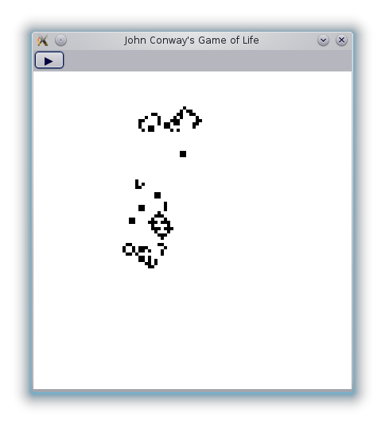

# Programming UIs

Functional reactive programming (FRP) is a functional, declarative technique for writing UI code. It is an alternative to the more standard imperative, event and callback-oriented programming style.

## A Game of Life

To help illustrate these concepts, we're going to write a simple program with FRP. I will cover exactly how to write the *core* part of the application---enough to make it usable--and leave some additional features as exercises. 

We will implement a simple version of [John Conway's Game of Life](http://en.wikipedia.org/wiki/Conway%27s_Game_of_Life). If you are not familiar with this "game", be sure to read about it: it's a fascinating subject all on its own and the favorite of hackers everywhere. In fact, the informal but rather popular ["hacker emblem"](http://www.catb.org/hacker-emblem/), which you may have seen in other contexts, comes from the Game of Life.

Since this article is entirely about the UI, I have implemented the rules of the game of life as [Game.hs](Game.hs). This implementation is based on some [slide](http://illustratedhaskell.org/index.php/2011/09/24/conways-game-of-life-with-repa/) available online; if you are interested, it is certainly a short and interesting exercise to write this yourself.

If you just want the final code, you can find it on [GitHub](https://github.com/TikhonJelvis/Reactive-Life). The default "minimalist" branch only has the core UI while the "master" branch has a bunch of additional features.

# Setting Up

We are going to be using Reactive Banana, a Haskell library. The actual UI toolkit is going to be [wxWidgets](http://www.haskell.org/haskellwiki/WxHaskell). 

If you don't have Haskell installed, you should get the [Haskell platform](http://www.haskell.org/platform/). You can install all the needed packages using `cabal`:

    cabal install reactive-banana-wx
    
Unfortunately, wx is well-known for being hard to build. You can find some information about wx and Haskell on the [wiki](http://www.haskell.org/haskellwiki/WxHaskell), including building instructions.

If you have problems with wx, the `#haskell` IRC channel on freenode is a great place to look for help. It is also a great place for Haskell-related questions in general. The people there are both knowledgeable and friendly.

# Events and Behaviors

In FRP, we want to represent **time-varying values**: anything that changes over time. In an imperative setting, we do this implicitly by relying on mutable state---when a value varies with time, we just mutate it. In a functional setting, we want to make the time more explicit.

The first kind of time-varying value we will look at is the **behavior**. A behavior is analogous to a signal: it's some value that can be changing continually. The current mouse position is a good example: the mouse always has a position, but that position may always be changing. We can model the mouse position as a `Behavior (Int, Int)`.

Abstractly, we can think of behaviors as functions from time. That is, a `Behavior (Int, Int)` is something like `Time → (Int, Int)`. We can "poll" the behavior: we can always ask it what the *current* value is. This is how we can deal with signals in a purely functional way. Importantly, `Time` is not an actual Haskell type. Rather, it is handled behind the scenes by the FRP framework. The function interpretation captures the *semantics* of a Behavior but not necessarily its implementation.

The second kind of time-varying value is the **event**. Behaviors *always* have a value, and the value can change *continuously*. Events are the discrete counterpoint to behaviors: they *sometimes* have a value, and the value changes *discretely*. We can think of an event as a value at some particular time. For example, pressing the E key at time `t` can be thought of as `('E', t)`.

However, in practice, we do not care about individual events. Rather, we care about **streams** of events. In Reactive Banana, the `Event` actually represents these streams. We could represent keyboard events as `Event Char`. Key presses only exist occasionally, at particular times, which is why this is a stream of events rather than a behavior.

Just as behaviors can be thought of as functions from time, streams of events can be thought of as potentially infinite lists. So `Event Char` is something like `[(Char, Time)]`. Both of these representations do not necessarily correspond to the actual implementations, but they make thinking about behaviors and events much easier.

# Some Scaffolding

Now lets just set up our widgets. At the very top of our file, we need to import a few modules:
    
    import Graphics.UI.WX hiding (Event)
    import Reactive.Banana
    import Reactive.Banana.WX
    import Life.Game
    
`Life.Game` is the module containing the rules of life which I [provided](Game.hs). It should be inside a folder called `Life` inside your source directory.

We are going to have a relatively simple setup: a single window containing a button and a panel, as well as a timer to tie everything together. The timer does not have a physical presence---it just sends out an event at a regular interval.

    main = start $ do
      mw          <- frame     [text := "Life", resizeable := False]
      lifeTimer   <- timer  mw [interval := 50]
      lifePanel   <- panel  mw [bgcolor := white]
      pauseButton <- button mw [text := "▶"]

The window is created using `frame` and called `mw`. The rest of the widgets are created in `mw`. Everything is inside a `do` statement which will also contain most of the rest of the code. The `start` function actually runs the window.

We also need to specify how to lay the widgets out. We can do this using `set` (still inside the `do` statement):

      set mw  [layout := column 2 [minsize (sz 40 25)   $ widget pauseButton,
                                   minsize (sz 800 800) $ widget lifePanel]]

All this is doing is putting the button and the window in a column, one on top of the other.

Compiling and running this as-is should get you a window looking very similar to the final result but without any functionality. 

