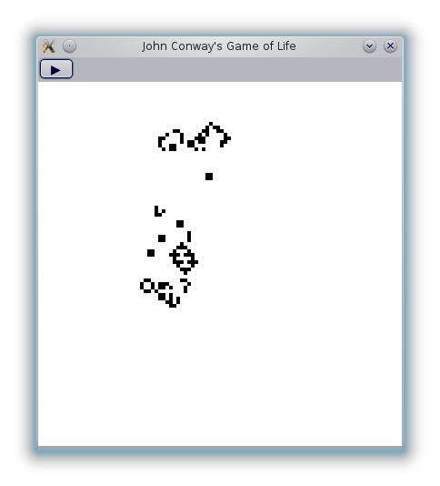

<div class="content">

# Functional Reactive Programming (FRP)

Functional reactive programming (usually referred to as FRP) is a novel, more declarative way of writing reactive systems like user interfaces and games. Essentially, FRP can be used wherever you would normally use an event/observer callback-based style.

## Slides

I recently did a survey of FRP for one of my CS classes. At the end of the semester, I gave a presentation on the subject. Here are my [slides](slides.html).

The slides are a little terse and cover both the more theoretical and the more practical sides of FRP.

</div>

<div class="content">

# Example



As part of my project, I created a *very* simple program to illustrate how FRP looks in practice. The goal was to find something simple enough to explain in about 5 minutes but complex enough to be interesting and use different FRP ideas.

For the demo, I managed to shrink the relevant code down to about eight lines. This required some simplifications and departures from the actual code, but all the departures were *reasonable*. Most of the actual difficulty lies with using an existing graphics toolkit not designed for FRP rather than the FRP code itself.

## Code

Even without the simplifications and with a bunch of boilerplate, the program is still only 38 lines long. Here are the relevant bits:

```haskell
$life$
```

There are some ugly parts---the way the grid is drawn is rather awkward. However, this is all the fault of wxWidgets (which, honestly, is not great) and *not* the fault of Reactive-Banana or FRP in general. Even with the impedence mismatch between wx and FRP, I think this code is very readable and better than any imperative, event-based alternative would be.

</div>
