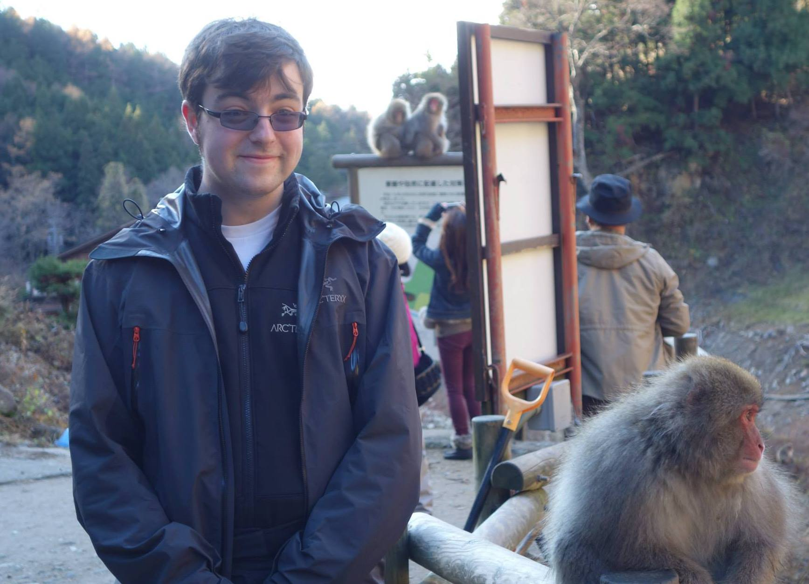

I gave a talk about [Inductive Graphs](talks/inductive-graphs-at-wagon) at the [SF Haskell meetup](http://www.meetup.com/Bay-Area-Haskell-Users-Group/) at [Wagon](http://wagonhq.com).

 

Another Ludum Dare. Another [game][shattered-worlds]! Play it. [Warning: sound.]

 

[Our paper on Chlorophyll](chlorophyll.pdf), a synthesis-aided compiler, was accepted to [PLDI 2014][PLDI].

[shattered-worlds]: http://alexnisnevich.github.io/ld30/
[PLDI]: http://conferences.inf.ed.ac.uk/pldi2014/acceptedpapers.html

I'm interested in programming languages, functional programming, program synthesis, static analysis, semantics, type theory and startups. In the near future I want to combine as many of these as possible.

I enjoy presenting about CS and try to give [talks at meetups](talks) regularly. I like writing too but don't update my blog nearly often enough—I'm more active on [Quora](https://www.quora.com/Tikhon-Jelvis/) and [StackOverflow](http://stackoverflow.com/users/286871/tikhon-jelvis), writing mostly (but not entirely) about CS.

I studied at Berkeley and interned at a few different companies including Jane Street Capital, a trading firm that is the largest commercial user of OCaml. I also did some research on program synthesis at the Berkeley ParLab with professor Bodik.

Outside CS, I'm an avid skier and a saber fencer (albeit on hiatus). I'm casually interested in typography and typefaces---one of these days, I'm going to design my own. I like literature, particularly anything with an existential bent, and music that's experimental to different degrees (everything from progressive metal to jazz to minimalist).

## Contact

Email me at [tikhon@jelv.is](mailto:tikhon@jelv.is). I am always happy to respond, especially about Haskell. However, I might take a while. If I don't write back for a couple of days, please feel free to prod me again: I lose track of things sometimes.

Unless otherwise noted, content on this site is available under a <a rel="license" href="http://creativecommons.org/licenses/by-sa/4.0/">Creative Commons Attribution-ShareAlike 4.0 International License</a>. If you want to use something beyond this license or have questions about it, feel free to contact me; I'm usually accommodating.

