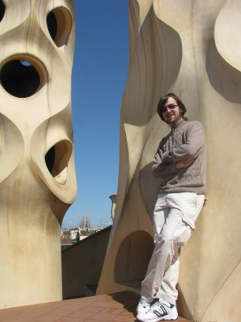

# Welcome

I gave a talk called ["Thinking with Laziness"](talks/thinking-with-laziness) at [BayHac 2015](http://bayhac.org).

 

Another Ludum Dare. Another [game][shattered-worlds]! Play it. [Warning: sound.]

 

[Our paper on Chlorophyll](chlorophyll.pdf), a synthesis-aided compiler, was accepted to [PLDI 2014][PLDI].

[shattered-worlds]: http://alexnisnevich.github.io/ld30/
[PLDI]: http://conferences.inf.ed.ac.uk/pldi2014/acceptedpapers.html

I like types. Both logic *and* typography.

I'm interested in programming languages, functional programming, program synthesis, static analysis, semantics, type theory and startups. In the near future I want to combine as many of these as possible.

I've worked at a few different companies including several startups and Jane Street Capital, a trading firm that is the largest commercial user of OCaml. I've also done some research on program synthesis at the Berkeley ParLab with professor Bodik.

Outside CS, I'm an avid skier and a saber fencer (albeit on hiatus). I'm oddly fascinated by typography---one of these days, I'm going to design my own typeface. I like literature, particularly anything with an existential bent, and music that's experimental to different degrees (everything from progressive metal to jazz to minimalist).

## Contact

Please feel free to contact me for any reason at <a href="mailto:tikhon@jelv.is">tikhon@jelv.is</a>. I am always happy to respond to emails, although I may take a while. I also use Jabber (Google Talk), and will probably be happy to chat if I'm online.

Unless otherwise noted, content on this site is available under a <a rel="license" href="http://creativecommons.org/licenses/by-sa/4.0/">Creative Commons Attribution-ShareAlike 4.0 International License</a>. If you want to use something beyond this license or have questions about it, feel free to contact me; I'm usually accommodating.

