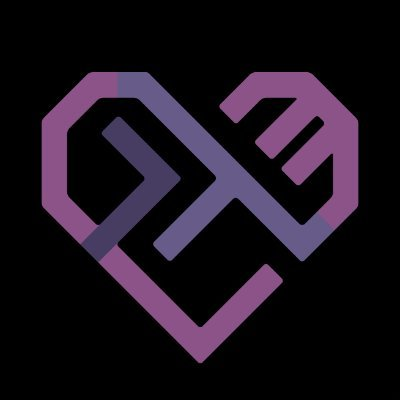

 
 
I'll be giving a talk at the [Haskell Love][haskell-love] conference, July 31–Aug 1 2020.

[haskell-love]: https://haskell.love

I'm a programmer with a background in functional programming and programming languages. I'm applying ideas from these fields to operations research at Target—we're developing a framework for expressing and solving large-scale stochastic optimization problems.

I enjoy writing and giving talks about CS. Check out my [talks] and my writing on my [blog], [Stack Overflow][so] and [Quora].

![I'm pointing to my screen as I explain something to my partner during a [Lean Poker] event.](img/me_pointing_to_screen.jpg)

[Lean Poker]: http://leanpoker.org/

[blog]: blog
[talks]: talks
[so]: http://stackoverflow.com/users/286871/tikhon-jelvis
[Quora]: https://www.quora.com/Tikhon-Jelvis/answers

## Contact

Email me at [tikhon@jelv.is](mailto:tikhon@jelv.is). I am always happy to respond to emails—if you don't hear back in a few days, please ping me again: I am liable to fall behind on emails.

Unless otherwise noted, content on this site is available under a <a rel="license" href="http://creativecommons.org/licenses/by-sa/4.0/">Creative Commons Attribution-ShareAlike 4.0 International License</a>. If you want to use something beyond this license or have questions about it, feel free to contact me; I'm usually accommodating.

