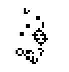

# Projects

## Current

[Semantic Version Control](/cow) 
  ~ 
  A proof-of-concept diff and merge algorithm that looks at the **structure of code** rather than just text. Currently it's in a background research phase, trying to put the algorithm from the proof-of-concept on a sound footing and implement it efficiently.

[Patricia Tries](projects/different-tries)
  ~  I'm implementing a couple of variants on Patricia tries to understand exactly how they work and how to optimize them. The end-goal is to efficiently implement a persistent adaptive radix tree.

## Ludum Dare

I've helped design and implement a couple of games in [Ludum Dare game jams][ld] which involve building a game with a small team in 72 hours to some random theme.

[Shattered Worlds][shattered-worlds]
  ~  A platformer where you can overlay a map from any level you've passed on top of the current level. The theme was "connected worlds" and Alex wrote a great [postmortem][shattered-worlds-postmortem] from the project.

[Asteroid Tycoon][asteroid-tycoon]
  ~  A tunneling game where you buy robots to mine asteroids. The robots do their own path finding and mine until they explode and teleport your reward to the ship. The theme was "below the surface" and Alex wrote a [ postmortem][asteroid-tycoon-postmortem] for this one as well.

[ld]: http://ludumdare.com/compo/

[shattered-worlds]: http://ludumdare.com/compo/ludum-dare-30/?action=preview&uid=3353
[shattered-worlds-postmortem]: http://ludumdare.com/compo/2014/09/11/shattered-worlds-postmortem/

[asteroid-tycoon]: http://ludumdare.com/compo/ludum-dare-29/?action=preview&uid=3353
[asteroid-tycoon-postmortem]: http://ludumdare.com/compo/2014/05/07/asteroid-tycoon-postmortem/

## Haskell

Haskell is now easily my favorite language. Here are some projects I've written in Haskell. Also check out my [blog](/blog) which tends to focus on Haskell and functional programming.

[TPL](/tpl)
  ~  A simple but flexible dynamically typed scripting language---with some design issues. **Designing a language is hard!** This project changed how I think about [programming language design][tpl-pl-design] and [programming in general][tpl-general], which I wrote about on Quora.

[modular-arithmetic][ma-github]
  ~  A simple library [on Hackage][ma-hackage] for creating integral types modulo some constant, like ``Integer `Mod` 10`` or, with some Unicode and operator goodness, `ℤ/10`.

[tpl-pl-design]: https://www.quora.com/If-you-were-to-design-a-programming-language-what-language-would-it-evolve-from-and-what-aspect-of-that-language-would-you-do-differently/answer/Tikhon-Jelvis?share=1
[tpl-general]: https://www.quora.com/What-programming-projects-have-given-you-the-most-insight-on-a-programming-concept-technique/answer/Tikhon-Jelvis?share=1

[ma-hackage]: https://hackage.haskell.org/package/modular-arithmetic
[ma-github]: https://github.com/TikhonJelvis/modular-arithmetic

[FRP](/frp)
  ~  My final project for CS 263, a survey of functional reactive programming (FRP) and the rich theory behind it. Includes a [game of life][reactive-life] GUI in 40 lines of code. I keep on meaning to turn it into a tutorial…

[reactive-life]: https://github.com/TikhonJelvis/reactive-life

## JavaScript

A few projects in JavaScript dating back from freshman year in college.

[Drawing](/draw)
  ~  A little toy for drawing pictures from mathematical functions---it can be a lot of fun! It applies a user-supplied JavaScript function to every pixel in a given area to produce neat designs.

[Cards](/cards)
  ~  A simple library for making card games in JavaScript, designed and implemented with a couple of other people during an [18-hour hackathon](http://www.huffingtonpost.com/marissa-louie/for-the-win-at-the-berkel_b_844749.html). We got second place!

[Maze](/maze)
  ~  Exploring randomly generated mazes with JavaScript and canvas. (Also see my [blog post][maze-post] about graphs and mazes in Haskell.)

[maze-post]: /blog/Generating-Mazes-with-Inductive-Graphs

## High School

Here are a couple of projects I worked on back in high school. (The rest, unfortunately, are lost to time.) Old, but still neat!

[Chess](/chess)
  ~  A JavaScript chess game with an AI developed by [Jessica Taylor][jessica], a friend. The AI only looks three moves ahead, but can still beat me :(.

[Simulation](/simulation)
  ~  A 2D physics engine supporting polygons and circles, written with [Jessica Taylor][jessica]. Had a basic physics engine built upon Newton's method (which we more or less rediscovered ourselves) and several tools for working with and viewing the simulation.

[jessica]: http://jessic.at

