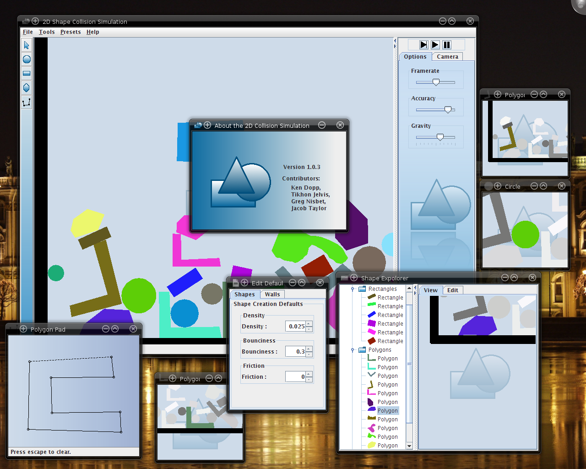

# 2D Collision Simulation

You can now get the code off [Github](https://github.com/TikhonJelvis/simulation)!

## Intro

This is a Java program that simulates collisions between polygons. I wrote this for physics during my junior year in high school. The project involved more than just writing a program---we also had to write a paper and perform some physical experiments. 

I worked with a team of three other students for this project. However, only [Jacob Taylor](http://stanford.edu/~jacobt) helped with the programming; the others worked on things like the physics experiment and presentation.

Jacob primarily worked on the actual physics, using Newton's method to approximate the change at each step and even deriving how torque worked from basic principles (We hadn't covered torque at all in class.)

I worked on the user interface and putting everything together. To make the design more module, I used the observer pattern---everything has to be a pattern in Java, after all.

## Powerpoint

As part of the project, we had to make and present a powerpoint presentation on the simulation. The slides give a good overview of the whole project. The presentation is available in [pdf](simulation.pdf) and [ppt](simulation.ppt).

# Overview

While in essence the simulation is a very simple program, it does
have quite a few features. I'm not going to list all of them right now, but here's a screenshot that illustrates its complexity.

We support any sort of polygon as well as circles. You can add shapes when everything is paused, but you can also add them interactively. You can even drag and throw shapes around while the simulation is active, which turns out to be pretty fun. All the parameters of the world and each shape---things like mass, friction, bounciness and gravity---can be changed on the fly for some potentially amusing effects.

Everything becomes much more fun---but also less realistic---if you set bounciness very high and density very low. 