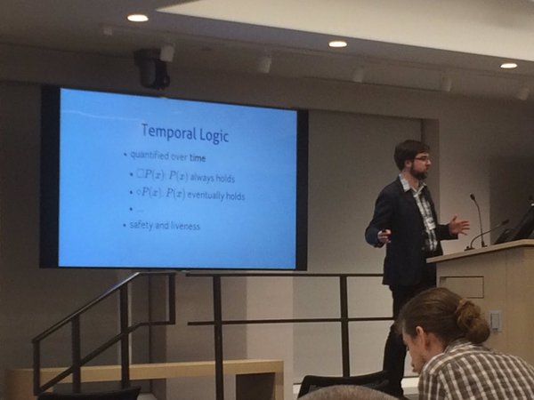

# Analyzing Programs with Z3

I gave a talk at Compose 2016 about bounded verification with Z3 in Haskell.

  * [slides](slides.html)
  * [code]
  * [papers, links, etc][bibliography]
  * [program synthesis class][class]

[haskell-z3]: https://hackage.haskell.org/package/z3
[code]: https://github.com/tikhonjelvis/imp
[class]: http://www.cs.berkeley.edu/~bodik/cs294fa12
[bibliography]: https://github.com/TikhonJelvis/talks/blob/master/compose-2016/bibliography.org

