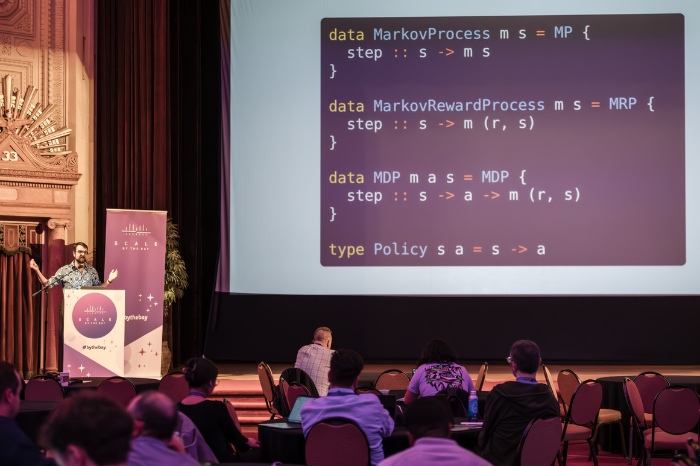

# Better Code Design with Types and Concepts

My first stab at explaining what I mean by "code design" and, especially, how static types can primarily be a tool *for design* rather than a tool for correctness.

I gave this talk at [Scale by the Bay 2023][sbtb-2023] in Oakland.

  * [slides](slides.html)
  * [video]
  
[video]: https://www.youtube.com/watch?v=Pp43qHiWtFk
[sbtb-2023]: https://scale.bythebay.io/

## Abstract

What can types do for us? Are types *exclusively* for preventing bugs? Is static typing inevitably an investment with short-term costs and long-term payoffs?

They don't have to be! With the right shift in mindset, types become a powerful tool for design and expression—not just a way to catch mistakes. By seeing programming and design in terms of *concepts* (as developed in Daniel Jackson's *The Essence of Software*), we can start systematically using types to drive the design of our systems, tie our concrete implementation code to specific concepts and even iterate on the conceptual models themselves.

The combination of types and concepts gives us a new foundation for thinking about code design and software engineering in general. We get a stronger foundation for designing our own codebases, libraries and APIs, as well as a direction for how to use and develop future tools like dependent type systems and AI code generation.

